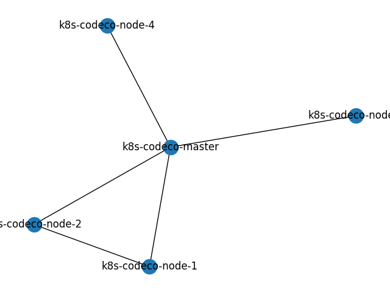
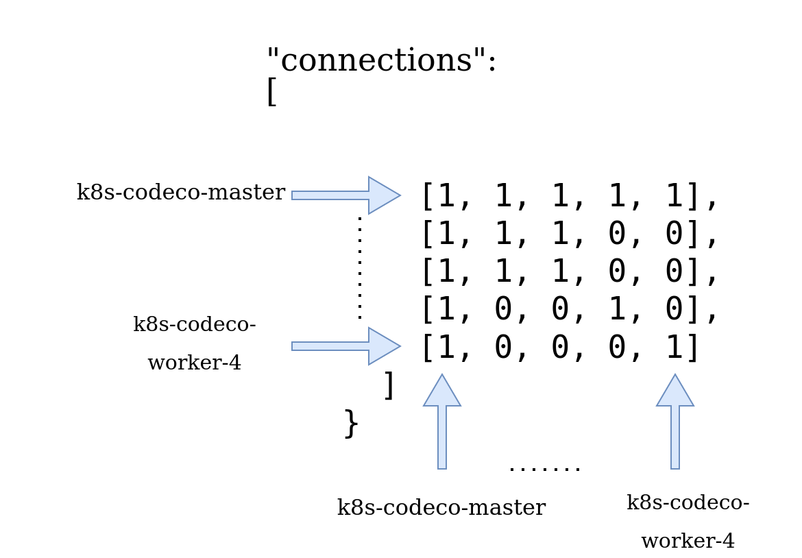
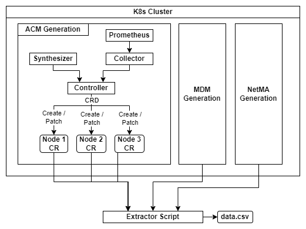

# Prerequisites
To use this code you should have the following:
- A Kubernetes Cluster
- Prometheus Installed in the Kubernetes Cluster (it is mandatory)
- Be the Admin of the cluster, with access to the `default` Service Account.
- Python Installed (Preferably v3.10)

## Prometheus Installation
To use Prometheus it is advised to install it via the following repository:
```
https://github.com/prometheus-operator/kube-prometheus
```
Yse the following commands on a Kubernetes Master to install:
```
# Clone Repo
git clone https://github.com/prometheus-operator/kube-prometheus

# Apply
kubectl apply --server-side -f manifests/setup
kubectl wait --for condition=Established --all CustomResourceDefinition --namespace=monitoring
kubectl apply -f manifests/
```

### Remove Prometheus
To Remove Prometheus that is installed with the above commands, do the following:
```
kubectl delete --ignore-not-found=true -f manifests/ -f manifests/setup
```

# Description
The code in this repository can be used to gain access to real and synthetic data for a Kupernetes Cluster. This Code is used to extract testing values for the ACM, MDM and NetMA components of CODECO.

With the Controllers, a script is given for data extraction as well. The script is in the following directory `data-extractor/extractor.py`. You can use it to create a `data.csv` file with all the information of the Controllers for a period of time.

## How it works
During the installation three CRDs are created and three deployments with proper roles to view and list the Kubernetes Nodes of a cluster, as well as create and patch CR objects of the created CRDs. The Deployments are the controllers below:
- ACM Controller: Provides data for the behaviour of ACM.
- MDM Controller: Provides data for the behaviour of MDM.
- NetMA Controller: Provides data for the behaviour of NetMA.

The objects that are created and patched by the above controllers can be used to extract real time monitoring information of the Kubernetes Cluster.

# Installing the Controllers
1. Before you install the controllers you must specify the Cluster's Topology.

To specify the Topology go the the file `netma-controller/netma-controller-deployment.yaml` and in the field `topology.json` specify your topology using the Node Names and their perspective adjacency matrix. You can find an example in the file: `netma-controller/topology.json`.


<br>

### Information related to topology file

In the topology.json file, the user/developer has to define his cluster’s topology. The topology gives an overview of the connected nodes within the cluster. The topology.json file provides a key-value pair where the value provides the clusters topology in a matrix.  Each row in the matrix provides for each of the indexed nodes its respective connections with other nodes, its an adjacency matrix, thus e.g., if the cluster consists of 5 nodes, then the matrix’s dimension will be 5X5.

<u>**Important note: For not having issues related to the netma controller (e.g. crashloop back off) it is mandatory to define the above mentioned topology in the netma controller as it is defined in the “netma-controller-deployment.yaml”  here  (the file includes an example- please replace it with the related topology)**</u>

An example is provided below depicting how to define the topology : 

SCENARIO:
If the user grants a cluster with 5 nodes (included master) as it is depicted in the below figure: 

**(corresponding node names: _k8s-codeco-master, k8s-codeco-node-1, k8s-codeco-node-2, k8s-codeco-node-3, k8s-codeco-node-4_)**



According to the figure the topology is defined: 
<br>

```
{
   "node_names": [
      "k8s-codeco-master",
      "k8s-codeco-node-1",
      "k8s-codeco-node-2",
      "k8s-codeco-node-3",
      "k8s-codeco-node-4"
   ],
   "connections": [
      [1, 1, 1, 1, 1],
      [1, 1, 1, 0, 0],
      [1, 1, 1, 0, 0],
      [1, 0, 0, 1, 0],
      [1, 0, 0, 0, 1]
   ]
}
```

<br>
How the topology is filled based on the above figure:

<br>


<br>

2. Run the following commands to use the installation script:
```
apply-controllers
```

## How to Uninstall the Controllers
Run the following commands to use the deletion script:
```
delete-controllers
```

## Test Controllers without the Extractor
If you want to test in a fast way the controllers try running the following for the ACM Controller. Just fill in one of your node names in the `<node-name>` field.
```
kubectl get acm-mons <node-name>-object -o=jsonpath='{.spec.node_name}:{.spec.cpu}:{.spec.mem}:{.spec.node_failure}:{.spec.node_energy}:{.spec.node_sec} -n he-codeco-acm'
```
You can test MDM and NetMA controllers as well with the following commands:
```
kubectl get mdm-mons <node-name>-object -o=jsonpath='{.spec.node_name}:{.spec.freshness}:{.spec.compliance}:{.spec.portability} -n he-codeco-mdm'
kubectl get netma-mons <node-name>-object -o=jsonpath='{.spec.node_name}:{.spec.link_id}:{.spec.link_failure}:{.spec.node_net_failure}:{.spec.ebw}:{.spec.ibw}:{.spec.latency}:{.spec.uid_visits}:{.spec.uid_location}:{.spec.zone}:{.spec.node_degree}:{.spec.path_length}:{.spec.link_energy}:{.spec.node_net_energy} -n he-codeco-netma'
```

# Execute the Extractor
To Execute the extractor and gather results you can run the following:
```
pip install -r requirements-v3.10.6.txt
python3 extractor.py mode=<mode>
```

## Comments for the Execution
- The mode can be either `append` or `write`
   - For the first time of the execution you should use `write` to create a new `data.csv` file.
   - The above will append new information on the `data.csv` file, or create new information on a new file.
- You can use the above script with other Python versions, but the requirments will probably not be the same.

## Main Logic of the Traffic Generator

   The python file entitled traffic_generator.py implements the entire logic in order to produce the values provided by the Annex (FOR).

   The rationale underlying this particular generator involves the delineation of two distinct sub-categories of data-producing components: a) the "collector" sub-component, and b) the "synthesizer" sub-component.

   -	Collector
      As previously mentioned, certain ANNEX attributes like CPU and memory can be directly collected through the Prometheus monitoring engine. Consequently, specific ANNEX features are furnished directly by the Prometheus engine, necessitating its installation to facilitate the operation of the CODECO traffic generator.

   -	Synthesizer
      While certain feature values such as MDM-freshness, ACM-Packetloss, ACM-resilience, etc., are not directly retrievable from Prometheus metrics, custom formulas adhering to specific logic have been devised to calculate these metrics.
   
   Below you can find which parameters derived directly from collector and which from synthesizer:

   ### ACM
   1. Features provided by Collector (directly from prometheus without additional modifications): 

   ```
   cpu, memory
   ```
   2. Features provided by Synthesizer

```
node_name,geolocation,userid,usergroup,QoS_class,energy,resillience,security
```
    
   ### NetMA
   All the features provided by the Synthesizer


   ### MDM
   All the features provided by the Synthesizer

  

   The above two sub-components are working in parallel and are exposing the proper values for the proposed ANNEX features.


   ### Notes:
   -	The propagated values are collected by controllers where their responsibility is to update the CRs. The extractor calls the CRDs to retrieve the updated metrics.
   -	We consider 3 CRDs – one for each CODECO component.
   - The implemented Data Generator has already been tested in two different k8s clusters: <br>
    **a)** A 2-node k8s cluster (control-plane and a worker with  AMD64 hardware), <br>
    **b)** A 5-node k8s cluster (control-plane with AMD64 hardware and 4 workers with ARM hardware).


# Flow



# Authors:
- Panagiotis Karamolegkos (UPRC)
- Pepi Paraskevoulakou (UPRC)